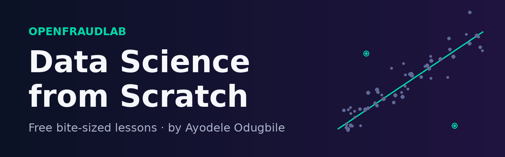

<p align="center">
  
</p>

<p align="center">
  <a href="https://www.tiktok.com/@_drhola"></a>
  <a href="https://www.linkedin.com/in/ayodele-odugbile-939b97185"></a>
  
  
  
</p>

<h3 align="center">Learn data science one 90-second lesson at a time.</h3>

<p align="center">
  A free, beginner-friendly course from <b>OpenFraudLab</b>, built by <b>Ayodele Odugbile</b>.<br>
  Every lesson comes with a short video, study notes, and a small exercise to try yourself.
</p>

<table align="center"><tr><td align="center">
<b>👉 Before you start</b><br><br>
<b>1. <a href="https://www.tiktok.com/@_drhola">Follow @_drhola on TikTok</a></b> so you never miss a lesson<br>
<b>2. Like</b> each video. It helps the lessons reach more learners<br>
<b>3. Share</b> with a friend who wants to learn data science<br>
<b>4. Comment</b> with your questions. They shape future lessons
</td></tr></table>

---

## 📌 Contents

- [Why this course](#-why-this-course)
- [Who it's for](#-whos-it-for)
- [How to use this course](#-how-to-use-this-course)
- [Course map](#-course-map)
- [Roadmap](#-roadmap)
- [About the instructor](#-about-the-instructor)
- [Questions, feedback & corrections](#-questions-feedback--corrections)

## 💡 Why this course

Most people give up on data science before they start, because the first step looks like a mountain of maths and code. This course goes the other way: **one idea per lesson, explained in plain language, in about a minute and a half.**

The examples lean on real-world problems such as lending, payments and fraud. These are areas where data science quietly makes decisions about people every day, so you'll learn to ask good questions of data and not just run models.

## 🎯 Who it's for

- **Complete beginners** curious about data science, analytics or AI
- **Students** who want the intuition behind what their textbooks teach
- **Professionals** in finance, banking, fintech or operations who work alongside data teams
- **Anyone** who wants to understand what's behind the AI headlines

No prior coding or statistics knowledge is needed. Code arrives gradually, from Module 3 onward.

## 🧭 How to use this course

| Step | What to do |
|:-:|:--|
| **1. Watch** | Start with the short video on [TikTok @_drhola](https://www.tiktok.com/@_drhola). Follow, like, share and comment as you go. |
| **2. Read** | Open the lesson's **study notes** for the key ideas and the full transcript. |
| **3. Practise** | Do the **"Try it yourself"** exercise at the end of each note. It takes about 5 minutes. |
| **4. Ask** | Drop a question in the TikTok comments, or open an [Issue](../../issues) here. |

> **Tip:** [Follow @_drhola on TikTok](https://www.tiktok.com/@_drhola) to get each lesson as it's released, and ⭐ **star this repo** to keep the notes one click away.

## 📚 Course map

<!-- COURSE-TABLE:START -->
#### Module 1 · Foundations

| # | Lesson | Watch | Study notes |
|:-:|:--|:-:|:-:|
| 1 | What is data science, really? | [▶ Watch](https://www.tiktok.com/@_drhola) | [📝 Notes](notes/lesson-01.md) |
| 2 | Types of data, and why they matter | [▶ Watch](https://www.tiktok.com/@_drhola) | [📝 Notes](notes/lesson-02.md) |
| 3 | Your first dataset: rows, columns & features | [▶ Watch](https://www.tiktok.com/@_drhola) | [📝 Notes](notes/lesson-03.md) |

#### Module 2 · Statistics & Exploring Data

| # | Lesson | Watch | Study notes |
|:-:|:--|:-:|:-:|
| 4 | Mean, median & mode: describing data with one number | [▶ Watch](https://www.tiktok.com/@_drhola) | [📝 Notes](notes/lesson-04.md) |
| 5 | Spread: range, variance & standard deviation | [▶ Watch](https://www.tiktok.com/@_drhola) | [📝 Notes](notes/lesson-05.md) |
| 6 | Distributions and the normal curve | [▶ Watch](https://www.tiktok.com/@_drhola) | [📝 Notes](notes/lesson-06.md) |
| 7 | Outliers: errors, or the most interesting rows? | [▶ Watch](https://www.tiktok.com/@_drhola) | [📝 Notes](notes/lesson-07.md) |
| 8 | Missing data and what to do about it | [▶ Watch](https://www.tiktok.com/@_drhola) | [📝 Notes](notes/lesson-08.md) |
| 9 | Data cleaning basics | [▶ Watch](https://www.tiktok.com/@_drhola) | [📝 Notes](notes/lesson-09.md) |
| 10 | Exploratory data analysis (EDA) | [▶ Watch](https://www.tiktok.com/@_drhola) | [📝 Notes](notes/lesson-10.md) |
| 11 | Choosing the right chart | [▶ Watch](https://www.tiktok.com/@_drhola) | [📝 Notes](notes/lesson-11.md) |
| 12 | Correlation is not causation | [▶ Watch](https://www.tiktok.com/@_drhola) | [📝 Notes](notes/lesson-12.md) |
| 13 | Sampling and sampling bias | 🔜 Soon | — |
| 14 | Probability basics for data science | 🔜 Soon | — |

#### Module 3 · Tools of the Trade

| # | Lesson | Watch | Study notes |
|:-:|:--|:-:|:-:|
| 15 | Why Python for data science | 🔜 Soon | — |
| 16 | Meet the pandas DataFrame | 🔜 Soon | — |
| 17 | SQL basics: SELECT, WHERE, GROUP BY | 🔜 Soon | — |

#### Module 4 · Machine Learning Essentials

| # | Lesson | Watch | Study notes |
|:-:|:--|:-:|:-:|
| 18 | Train/test split: why we hide data from the model | 🔜 Soon | — |
| 19 | Linear regression intuition | 🔜 Soon | — |
| 20 | Classification and logistic regression | 🔜 Soon | — |
| 21 | Overfitting vs underfitting | 🔜 Soon | — |
| 22 | Why accuracy can lie | 🔜 Soon | — |
| 23 | The confusion matrix, precision & recall | 🔜 Soon | — |
| 24 | Decision trees | 🔜 Soon | — |
| 25 | Feature engineering | 🔜 Soon | — |
| 26 | Cross-validation | 🔜 Soon | — |
| 27 | Imbalanced data: the fraud detection problem | 🔜 Soon | — |

#### Module 5 · Responsible Data Science & Next Steps

| # | Lesson | Watch | Study notes |
|:-:|:--|:-:|:-:|
| 28 | Explainable AI: why did the model decide that? | 🔜 Soon | — |
| 29 | Data ethics and bias in models | 🔜 Soon | — |
| 30 | Your data science roadmap | 🔜 Soon | — |

#### Module 6 · Going Further

| # | Lesson | Watch | Study notes |
|:-:|:--|:-:|:-:|
| 31 | Project 1 · Part 1: Credit risk — framing the problem and preparing the data | 🔜 Soon | — |
| 32 | Project 1 · Part 2: Credit risk — what drives default? | 🔜 Soon | — |
| 33 | Project 1 · Part 3: Credit risk — a default model and an approval policy | 🔜 Soon | — |
| 34 | Project 2 · Part 1: Clinic no-shows — framing the problem and preparing the data | 🔜 Soon | — |
| 35 | Project 2 · Part 2: Clinic no-shows — who misses appointments, and why? | 🔜 Soon | — |
| 36 | Project 2 · Part 3: Clinic no-shows — predicting no-shows and targeting reminders | 🔜 Soon | — |
| 37 | Project 3 · Part 1: City rents — cleaning listings and building features | 🔜 Soon | — |
| 38 | Project 3 · Part 2: City rents — exploring prices across the city | 🔜 Soon | — |
| 39 | Project 3 · Part 3: City rents — a price model, error analysis and portfolio write-up | 🔜 Soon | — |

<sub>12 of 39 planned lessons released · new lessons are added daily.</sub>
<!-- COURSE-TABLE:END -->

## 🗺️ Roadmap

| Status | Milestone |
|:-:|:--|
| ✅ | Daily lessons on TikTok, with study notes in this repository |
| 🔜 | **YouTube:** full-length compilations of each module, one video per module |
| 🔜 | **OpenFraudLab learning hub:** the complete course in one place, with progress tracking and downloadable resources |

## 👤 About the instructor

**Ayodele Odugbile** is a data and analytics professional with more than six years of experience across credit risk analytics, fraud detection, portfolio management and data engineering. He runs **OpenFraudLab**, an independent research initiative focused on trustworthy and explainable AI.

👉 [Connect with Ayodele on LinkedIn](https://www.linkedin.com/in/ayodele-odugbile-939b97185)

This course is his way of making the field easier to enter, especially for learners who don't come from a computer science background.

## 💬 Questions, feedback & corrections

Accuracy matters here. If you spot a mistake, find something confusing, or want a topic covered:

- **Open an [Issue](../../issues)** with the lesson number and what you noticed, or
- **Comment on the lesson's TikTok video.**

<details>
<summary><b>How these lessons are made</b></summary>
<br>

Lesson scripts are drafted with AI assistance, and the videos are narrated with an AI-generated voice. That's why every TikTok post carries the AI-generated content label. The study notes in this repo are built from the same scripts, so the video, transcript and notes always match. Corrections from learners are welcome and are folded into future lessons.

</details>

<details>
<summary><b>Repository structure</b></summary>
<br>

```
├── notes/          Study notes for each lesson (start here)
├── videos/         Lesson videos (vertical, about 60 to 90 seconds)
├── lessons/        Lesson scripts as structured data (slides + narration)
├── curriculum.json Full course outline
├── scripts/        Tools that build the videos and the notes
├── docs/           Production and automation notes
└── assets/         Images used on this page
```

</details>

---

<p align="center">
  <sub>© 2026 Ayodele Odugbile · OpenFraudLab · Built to make data science accessible to everyone.</sub>
</p>
